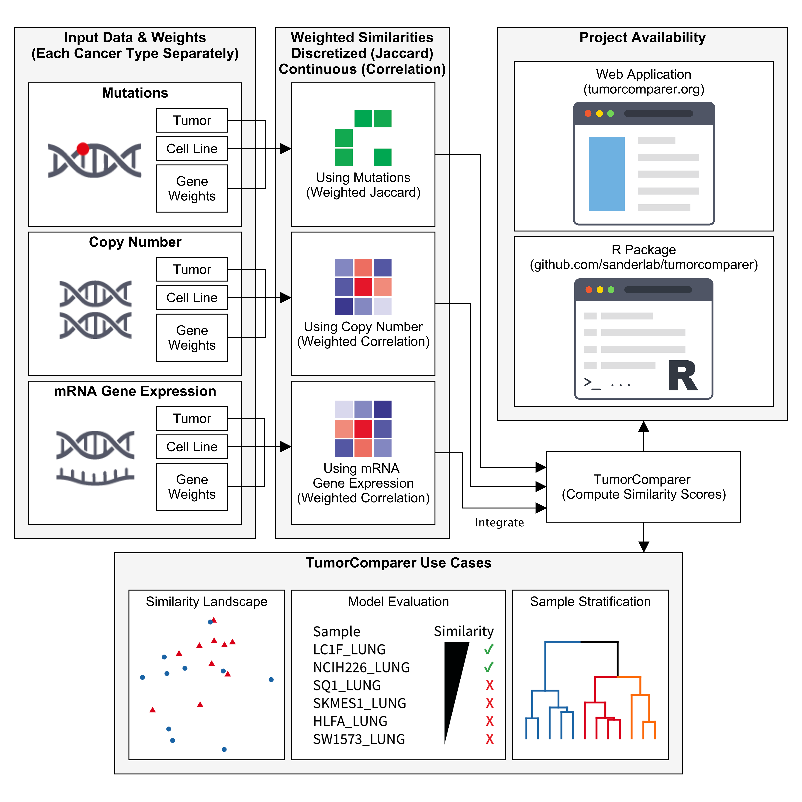

```{r include=FALSE}
knitr::opts_chunk$set(echo=FALSE, message=FALSE, warning=FALSE)
```

```{r}
library(tumorcomparer)
pkg_name <- "tumorcomparer"
pkg_version <- as.character(packageVersion(pkg_name))
```

TumorComparer uses tumor and cell line profiles to guide experimental model (e.g., cell lines) choice. TumorComparer uses a weighted feature approach to compare tumors from the The Cancer Genome Atlas (TCGA) project to experimental cell line models from the Cancer COSMIC Cell Line Project (CCLP) for several cancer types.

If you use content from this page, please cite [Sinha et al., 2021. DOI: 10.1016/j.crmeth.2021.100039](https://www.sciencedirect.com/science/article/pii/S2667237521000849){target="_blank"}.

## TumorComparer Comparison Summaries by Cancer Type

* [Breast Cancer (BRCA)](brca_cclp_tcga_tumorcomparer.html)
* [Colon Cancer (COAD)](coad_cclp_tcga_tumorcomparer.html)
* [Endometrial Cancer (UCEC)](ucec_cclp_tcga_tumorcomparer.html)
* [Esophageal Cancer (ESCA)](esca_cclp_tcga_tumorcomparer.html)
* [Kidney Cancer (KIRC)](kirc_cclp_tcga_tumorcomparer.html)
* [Liver Hepatocellular Cancer (LIHC)](lihc_cclp_tcga_tumorcomparer.html)
* [Lung adenocarcinoma (LUAD)](luad_cclp_tcga_tumorcomparer.html)
* [Ovarian Cancer (OV)](ov_cclp_tcga_tumorcomparer.html)
* [Pancreatic Cancer (PAAD)](paad_cclp_tcga_tumorcomparer.html)
* [Stomach Cancer (STAD)](stad_cclp_tcga_tumorcomparer.html)
* [Thyroid Cancer (THCA)](thca_cclp_tcga_tumorcomparer.html)

## TumorComparer Workflow to Compare Tumors and Cell Lines



## Customized Comparisons of Tumor and Cell Line Data

Each project has unique questions. TumorComparer ([tumorcomparer.org](http://tumorcomparer.org){target="_blank"}) facilities customized comparisons of cell line datasets to tumor samples directly from the browser. 

## Technical Information

This analysis was generated using TumorComparer: `r pkg_version`. If you use content from this page, please cite [Sinha et al., 2021. DOI: 10.1016/j.crmeth.2021.100039](https://www.sciencedirect.com/science/article/pii/S2667237521000849){target="_blank"}.